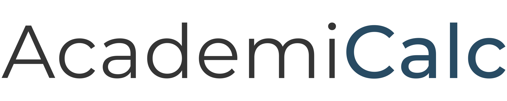

<a name="readme-top"></a>

<!-- PROJECT SHIELDS -->
[![Contributors][contributors-shield]][contributors-url]
[![Forks][forks-shield]][forks-url]
[![Stargazers][stars-shield]][stars-url]
[![Issues][issues-shield]][issues-url]
[![MIT License][license-shield]][license-url]
[![LinkedIn][linkedin-shield]][linkedin-url]

<!-- PROJECT LOGO -->
<br />
<div align="center">
  <a href="https://github.com/brendan-sadlier/academicalc">
    
  </a>
  
  </img>

  <p align="center">
    <a href="https://github.com/brendan-sadlier/academicalc/issues">Report Bug</a>
    ·
    <a href="https://github.com/brendan-sadlier/academicalc/issues">Request Feature</a>
  </p>
</div>

<!-- TABLE OF CONTENTS -->
<details>
  <summary>Table of Contents</summary>
  <ol>
    <li>
      <a href="#about-the-project">About The Project</a>
      <ul>
        <li><a href="#built-with">Built With</a></li>
      </ul>
    </li>
    <li><a href="#getting-started">Getting Started</a></li>
    <li><a href="#roadmap">Roadmap</a></li>
    <li><a href="#contributing">Contributing</a></li>
    <li><a href="#license">License</a></li>
    <li><a href="#contact">Contact</a></li>
  </ol>
</details>

## About The Project

[![Product Name Screen Shot][product-screenshot]](https://github.com/brendan-sadlier/academicalc)

AcademicCalc is an innovative web application designed to simplify the academic lives of students across the globe. This app aims to provide a user-friendly platform for students to accurately calculate their Grade Point Average (GPA), track their academic progress, and set academic goals with ease.

<p align="right">(<a href="#readme-top">back to top</a>)</p>

### Built With

[![Node][Node.js]][Node-url]
[![React][React.js]][React-url]
[![PostgreSQL][PostgreSQL]][PostgreSQL-url]
[![MaterialUI][MaterailUI]][MaterailUI-url]

<p align="right">(<a href="#readme-top">back to top</a>)</p>

<!-- GETTING STARTED -->
## Getting Started

This is an example of how you may give instructions on setting up your project locally.
To get a local copy up and running follow these simple example steps.

### Prerequisites

This is an example of how to list things you need to use the software and how to install them.
* npm
  ```sh
  npm install npm@latest -g
  ```

### Installation

1. Clone the repo
   ```sh
   git clone https://github.com/brendan-sadlier/academicalc.git
   ```
2. Install NPM packages
   ```sh
   npm install
   ```
3. Start the server
   ```sh
   npm start
   ```
4. Open your browser and navigate to `localhost:3000`

<p align="right">(<a href="#readme-top">back to top</a>)</p>

<!-- ROADMAP -->
## Roadmap

- [ ] Basic GPA Calculator
- [ ] Multiple Semesters and Years Support
- [ ] GPA Planning Calculator
- [ ] User Authentication
    - [ ] User Profiles
    - [ ] User Data Storage
- [ ] Mobile Application

<p align="right">(<a href="#readme-top">back to top</a>)</p>

<!-- CONTRIBUTING -->
## Contributing

Contributions are what make the open source community such an amazing place to learn, inspire, and create. Any contributions you make are **greatly appreciated**.

If you have a suggestion that would make this better, please fork the repo and create a pull request. You can also simply open an issue with the tag "enhancement".
Don't forget to give the project a star! Thanks again!

1. Fork the Project
2. Create your Feature Branch (`git checkout -b feature/AmazingFeature`)
3. Commit your Changes (`git commit -m 'Add some AmazingFeature'`)
4. Push to the Branch (`git push origin feature/AmazingFeature`)
5. Open a Pull Request

See the [open issues](https://github.com/brendan-sadlier/grademaster/issues) for a full list of proposed features (and known issues).

<p align="right">(<a href="#readme-top">back to top</a>)</p>

<!-- LICENSE -->
## License

Distributed under the MIT License. See `LICENSE.txt` for more information.

<p align="right">(<a href="#readme-top">back to top</a>)</p>


<!-- CONTACT -->
## Contact

Brendan Sadlier - [@brendansadlier](https://twitter.com/brendansadlier)

Project Link: [https://github.com/brendan-sadlier/acadeicalc](https://github.com/brendan-sadlier/grademaster)

<p align="right">(<a href="#readme-top">back to top</a>)</p>

<!-- MARKDOWN LINKS & IMAGES -->
[contributors-shield]: https://img.shields.io/github/contributors/brendan-sadlier/academicalc.svg?style=for-the-badge
[contributors-url]: https://github.com/brendan-sadlier/academicalc/graphs/contributors
[forks-shield]: https://img.shields.io/github/forks/brendan-sadlier/academicalc.svg?style=for-the-badge
[forks-url]: https://github.com/brendan-sadlier/academicalc/network/members
[stars-shield]: https://img.shields.io/github/stars/brendan-sadlier/academicalc.svg?style=for-the-badge
[stars-url]: https://github.com/brendan-sadlier/academicalc/stargazers
[issues-shield]: https://img.shields.io/github/issues/brendan-sadlier/academicalc.svg?style=for-the-badge
[issues-url]: https://github.com/brendan-sadlier/academicalc/issues
[license-shield]: https://img.shields.io/github/license/brendan-sadlier/academicalc.svg?style=for-the-badge
[license-url]: https://github.com/brendan-sadlier/academicalc/blob/main/LICENSE
[linkedin-shield]: https://img.shields.io/badge/-LinkedIn-black.svg?style=for-the-badge&logo=linkedin&colorB=0A66C2
[linkedin-url]: https://www.linkedin.com/in/brendan-sadlier-24672823a/

[product-screenshot]: https://placehold.co/800x200/png

[React.js]: https://img.shields.io/badge/React-20232A?style=for-the-badge&logo=react&logoColor=61DAFB
[React-url]: https://reactjs.org/
[Node.js]: https://img.shields.io/badge/Node.js-339933?style=for-the-badge&logo=node.js&logoColor=white
[Node-url]: https://nodejs.org/en/
[PostgreSQL]: https://img.shields.io/badge/PostgreSQL-4169E1?style=for-the-badge&logo=postgresql&logoColor=white
[PostgreSQL-url]: https://www.postgresql.org/
[MaterailUI]: https://img.shields.io/badge/mui-007FFF?style=for-the-badge&logo=mui&logoColor=white
[MaterailUI-url]: https://material-ui.com/